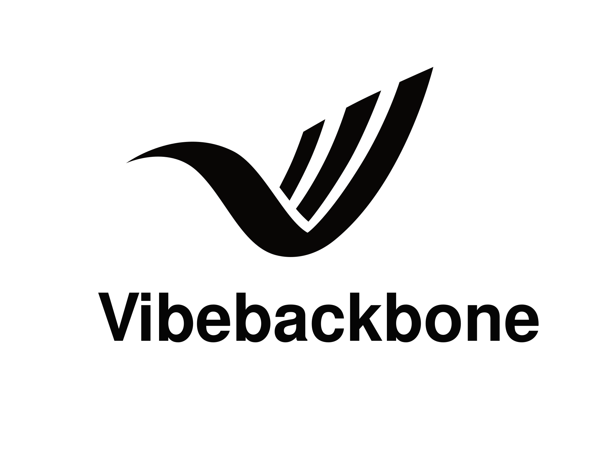

<p align="center">
  
  <br/>
  <strong style="font-size: 1.4em;">64 skills · 33 prompts (7 canoniques + 25 spécialisés + 1 router) · 4 familles de voies + MVP START gate · 7 phases agentiques</strong>
</p>

<p align="center">Le système d'orchestration pour agents IA qui transforme le chaos de développement en pilotage prévisible.</p>

---

## English quick entry

Vibebackbone is an operational governance system for LLM agents.
It provides skills, prompts, routing rules, audit workflows, quality conventions,
and verification loops to make agentic development predictable, traceable and reviewable.

**Start here:**
- [`docs/CONTEXT.md`](docs/CONTEXT.md) — persistent central router, first file to read
- [`docs/PILOTAGE.md`](docs/PILOTAGE.md) — operational triage and routing rules
- [`docs/CONVENTIONS.md`](docs/CONVENTIONS.md) — quality conventions (5 pillars: Readability, Modularity, Coherence, Traceability, Robustness)
- [`GUIDE.md`](GUIDE.md) — full workflow guide with routes, phases, and examples

**Counters**: 64 skills · 33 prompts · 4 route families · MVP START gate

> **VBB Core vs Distributions.** This repository holds **VBB Core** — the
> generic, agent-agnostic method (skills, prompts, tools, templates, governance
> docs). Operational declinations for a specific agent runtime are called
> **Distributions** and live **inside this repo at `distributions/`**. The currently active
> distribution is **Hermes/Cody** (under `distributions/hermes/` and the runtime
> profile at `~/.hermes/profiles/vbb-*/`). For the
> full distinction, Core ↔ Distribution propagation rules, and worked examples
> (ADR/POC gate, profiles SOUL.md, security proxy), see
> [`docs/DISTRIBUTIONS.md`](docs/DISTRIBUTIONS.md). Enforced by
> [AGENTS.md Critical Rule #11](AGENTS.md#critical-rules).

---

---

## Le problème

Vous travaillez avec des agents IA (Claude Code, Codex, Cursor, Qwen, Gemini…). Chaque session est une aventure : le modèle improvise, invente des workflows, oublie le contexte, écrit des trucs qu'il ne fallait pas, et vous devez tout relire. Le code part en sucette. La doc ment. Les audits n'arrivent jamais.

**Vous ne pilotez plus — vous subissez.**

## La solution

**vibebackbone** est un système de pilotage opérationnel pour agents IA. Ce n'est pas un framework, pas une librairie, pas un SaaS. C'est une grammaire de comportement que vous injectez dans le contexte de vos agents.

Le résultat ? Un orchestrateur silencieux qui :

- ✅ **trie** toute tâche en 25 ms (voie rapide, structurée, audit, clôture)
- ✅ **planifie** avant d'agir — fini le code sauvage
- ✅ **audite** la sécurité, l'intégrité des données, les contrats API, la dette technique
- ✅ **maintient** une discipline de contexte LLM (plus de saturation mémoire)
- ✅ **produit** des handoffs propres entre sessions

---

## Ce que contient ce repo

This repository is **VBB Core** — the generic, agent-agnostic method. The
structural layout of Core:

```
vibebackbone/             ← VBB Core (this repo)
├── AGENTS.md            ← agent-facing critical rules
├── GUIDE.md             ← long-form human guide
├── CONVENTIONS.md       ← quality pillars P1–P5 + rules P.R1–P.R8
├── docs/                ← canonical governance
│   ├── CONTEXT.md
│   ├── PILOTAGE.md
│   ├── ARCHITECTURE.md
│   ├── CONVENTIONS.md (mirror)
│   ├── templates/       ← ADR, POC, INTEGRATION_GATE, 01-07 phases
│   └── ...
├── skills/              ← 64 injectable skills
├── prompts/             ← 33 prompts (7 canon + 25 specialised + 1 router)
├── providers/           ← Claude Code, Codex, Pi, OpenCode adapters
├── tools/               ← vbb-architecture.py, vbb-gate-check.py, vbb-contract-lint.py, ...
└── tests/, scripts/     ← CI and verification loops
```

A **Distribution** (e.g. **Hermes/Cody**) is an operational declination of
Core for a specific agent runtime. Distributions are isolated **outside** this
repo, on purpose — it keeps Core agent-agnostic. See
[`docs/DISTRIBUTIONS.md`](docs/DISTRIBUTIONS.md) for the full distinction and
the Core ↔ Distribution propagation rules (enforced by
[AGENTS.md Critical Rule #11](AGENTS.md#critical-rules)).

## VBB Core vs Distributions

| Concern                         | VBB Core (this repo)                       | Distribution (e.g. Hermes/Cody)                              |
|---------------------------------|--------------------------------------------|--------------------------------------------------------------|
| What it is                      | Generic method, agent-agnostic             | Operational declination for one agent runtime                |
| Where it lives                  | This repository                            | Outside the repo (e.g. `~/.hermes/profiles/vbb-*/`)           |
| Examples of content             | Skills, prompts, templates, gates, linters | `SOUL.md` personas, orchestrator boot loop, registry, secrets |
| ADR/POC/Integration Gate        | ✅ `tools/vbb-gate-check.py`, templates, `GUIDE.md` §10bis | consumes Core (worker SOUL.md calls the tool) |
| Quality conventions             | ✅ `CONVENTIONS.md`, P.R1–P.R8             | inherits + applies                                            |
| Provider-specific glue          | n/a (provider adapters live in Core)       | Persona, paths, runtime config, secrets, hooks                |
| Security proxy (e.g. credential isolation) | n/a (operational)                | Lives in distribution, governed by proxy ADRs                |

**Rule of thumb:** if a rule applies to **any** agent runtime, it belongs in
Core. If it is glue to one specific runtime, it stays in the distribution.
The bidirectional propagation rule (Core→Dist impact check, Dist→Core
promote-or-keep) is in [AGENTS.md Critical Rule #11](AGENTS.md#critical-rules)
and tracked in [`docs/DISTRIBUTIONS.md` §Decisions log](docs/DISTRIBUTIONS.md#7-decisions-log).

```
vibebackbone/
├── skills/              # 64 skills prêts à injecter
│   ├── 0-vbb-*/        # Phase 0 : Readiness & cadrage (7)
│   ├── 1-vbb-*/        # Phase 1 : Structure & dette technique (16)
│   ├── 2-vbb-*/        # Phase 2 : Audits de fond (12)
│   ├── 3-vbb-*/        # Phase 3 : Consolidation (1)
│   ├── 4-vbb-*/        # Phase 4 : Front-end UX/UI (10)
│   ├── t-vbb-*/        # Transverse : Docker, Git, CI, deploiement (17)
│   └── vibebackbone/   # Orchestrateur principal + PILOTAGE.md
├── prompts/             # 33 prompts (7 canoniques + 25 spécialisés + 1 router)
│   ├── canonical/      # 7 prompts canoniques (un par phase 01–07)
│   └── t-p-vbb-phase-router.md  # Matrice de décision Markdown
├── docs/                # Fichiers de pilotage
│   ├── CONTEXT.md       # MOC / routeur central persistant (premier fichier à lire, versionné)
│   ├── MVP_START_PROTOCOL.md # Gate obligatoire avant code pour MVP depuis zéro
│   ├── PROJECT_MODE.md  # Signal de mode (généré par `t-vbb-project-context-init`)
│   ├── ARCHITECTURE.md  # Source canonique structurée de l'architecture
│   ├── RELATIONS.md     # Projection graphique générée depuis ARCHITECTURE.md
│   ├── SESSION.md       # Brouillon local éphémère (gitignoré)
│   ├── AUDIT_STATUS.md  # Audit dashboard — local au projet
│   └── audits/          # Rapports d'audit — locaux au projet
├── AGENTS.md            # Grammaire opérationnelle canonique
├── SYSTEM.md            # Comportement runtime Pi
├── CLAUDE.md            # Point d'entree universel pour Claude Code / Cursor
├── package.json         # Déclaration pi-package (skills + prompts)
├── .gitignore           # Ignore les artefacts de session locale
└── .pi/                 # Configuration Pi (locale, gitignorée)
    ├── agents/          # Supervisor template
    └── taskplane.json   # Config taskplane
```

### Les 64 skills en un coup d'œil

| Phase | Foyer | Skills |
|-------|-------|--------|
| **🔰 0** | Readiness & cadrage | Guide, Pilotage, RICO-readiness, Scope-freeze, Audit-readiness, Standard, Zero-friction *(3 méta/documentation, 4 opérationnels)* |
| **🔧 1** | Structure & dette | Code-janitor, Conventions, Formatter, Tech-debt, Monolith-detector, Logic-duplication-detector, Pattern-inconsistency-detector, Error-handling-auditor, Premature-abstraction-detector, Test-mirage-detector, Intent-decomposer, Code-doc-coherence-auditor, Code-doc-gap-integrator, Doc-harmonizer, API-contract-designer, ADR *(16)* |
| **🔬 2** | Audits de fond | API-auditor, DB-robustness, Data-integrity, Security, Systemic-risk, Ops, CI, Legal, Performance, Accessibility, Analytics, Spec-validator *(12)* |
| **📋 3** | Consolidation | Risk-register |
| **🎨 4** | Front-end UX/UI | User-experience-engine, Interaction-coherence, Visual-identity-layer, Visual-identity-gatekeeper, Design-system-validator, Micro-interaction-refiner, Cognitive-load-optimizer, Front-pipeline-reference, Security-remediation, Product-changelog |
| **🛠️ t-** | Transverse | Dependency-mapper, Impact-analyzer, Docker-audit, Docker-generate, Deploy-runtime, Git-sync, Commit-ready, Test-coverage-mapper, Session-handoff, Project-context-init, Anti-slop-gate, Mode-transition-gate, Status-report, Index, Context-compactor, LLM-healthcheck, Status-dashboard *(17)* |

Chaque skill est un fichier `SKILL.md` standardisé, indépendant, injectable dans n'importe quel agent LLM.

**Templates inclus :**
- `t-vbb-deploy-runtime/templates/deploy.sh` — script de déploiement Docker complet avec backup, rollback, healthcheck
- `t-vbb-docker-generate/templates/nginx/` — reverse-proxy production-ready (nginx.conf + security-headers.conf)

### Les 33 prompts — architecture en 3 couches

Les prompts sont organisés en **trois couches complémentaires** :

```
prompts/
├── canonical/                       ← 7 prompts génériques (un par phase agentique)
│                                      01-intake · 02-audit · 03-decision · 04-plan
│                                      05-execution · 06-review · 07-closeout
├── (racine)                         ← 25 prompts spécialisés + 1 router (domaine ou contexte précis)
└── t-p-vbb-phase-router.md          ← Matrice de décision Markdown
```

**Règle d'usage** :
- Utiliser les **canoniques** par défaut (multi-LLM, génériques).
- Utiliser les **spécialisés** quand le domaine est précis (sécurité, DB, Docker…).
- Consulter le **router** en cas de doute.

Détails : [`PROMPTS_ARCHITECTURE.md`](PROMPTS_ARCHITECTURE.md).

**Les 25 prompts spécialisés** :

| Phase | Prompts |
|-------|---------|
| **0** | Before-building, Plan, Triage, Zero-friction |
| **1** | Doc-feature, Legacy-level, Post-refacto-coherence, Project-init, Quick-task, Structured-task, Tech-debt |
| **2** | Audit-task, DB-sanity, Mode-transition, Release-check, Security-pipeline |
| **3** | Risk-register |
| **4** | After-building, Anti-slop, Deploy-docker |
| **t** | Branch-policy-check, Git-sync, Sequenced-ship, Session-handoff, Start-session |

---

## Comment ça marche

```
Tâche entrante
    │
    ▼
┌──────────────────────────────────────────────────┐
│  TRIAGE (via PILOTAGE.md)                        │
│                                                  │
│  MVP START gate → RICO readiness avant code      │  (MVP depuis zéro)
│  RAPIDE-ZERO   → Activity Log only (zéro friction)     │  (micro-tâche sûre)
│  RAPIDE-MINIMAL→ 05_PATCH_SUMMARY only                  │  (petite tâche non triviale)
│  Voie RAPIDE    → exécution directe              │  (risque faible)
│  Voie STRUCTURÉE → plan + exécution cadrée       │  (contrats, multi-fichiers)
│  Voie AUDIT     → séquence d'audit complète      │  (sécurité, intégrité)
│  Voie CLÔTURE   → handoff + session memory       │  (fin de session)
└──────────────────────────────────────────────────┘
    │
    ▼
┌──────────────────────────────────────────────────┐
│  EXÉCUTION (via skill correspondant)             │
│                                                  │
│  Chaque skill = 1 fichier SKILL.md               │
│  Frontmatter standardisé (name, description,     │
│  version, phase, token_budget, mode_sensitive)   │
│  Input contract → Steps → Output contract        │
└──────────────────────────────────────────────────┘
    │
    ▼
Résultat prévisible, traçable, reproductible
```

L'agent ne décide plus tout seul. Il suit une grammaire documentée, lisible et vérifiable.

Pour un MVP démarré depuis zéro, l'agent applique d'abord
[`docs/MVP_START_PROTOCOL.md`](docs/MVP_START_PROTOCOL.md) via
`0-vbb-rico-readiness`. Tant que la readiness n'est pas `READY`, il reste en
cadrage et produit des questions bloquantes au lieu de coder.

---

## Les quatre couches Vibebackbone

- `skills/` : capacités actionnables spécialisées
- `prompts/` : points d’entrée de session
- `AGENTS.md` : gouvernance universelle
- `SYSTEM.md` : comportement runtime

---

## Architecture vivante

`docs/ARCHITECTURE.md` est la source canonique structurée de l'architecture :
chaque bloc y déclare rôle, responsabilités, dépendances, impacts, fichiers,
contrats, tests, risques et statut. `docs/RELATIONS.md` est généré depuis cette
source et fournit la projection Mermaid, les zones sensibles et l'index d'impact.

```bash
python tools/vbb-architecture.py lint
python tools/vbb-architecture.py graph --write
```

Toute modification qui touche l'architecture, le routage, les contrats, la
gouvernance, les adaptateurs provider, la CI ou l'outillage sensible doit être
référencée dans `docs/ARCHITECTURE.md`. Le lint échoue si un fichier
architecture-sensible n'est couvert par aucun bloc.

---

## 📚 Documentation

**Pour humains (pédagogique)** :
- **[`GUIDE.md`](GUIDE.md)** — Guide complet : cas d'usages, pilotage au quotidien, anti-patterns, cheatsheet
- **[`PROMPTS_ARCHITECTURE.md`](PROMPTS_ARCHITECTURE.md)** — Architecture des 3 couches de prompts

**Point de départ opérationnel** :
- **[`docs/CONTEXT.md`](docs/CONTEXT.md)** — MOC / routeur central persistant, premier fichier à lire au démarrage
- **[`docs/MVP_START_PROTOCOL.md`](docs/MVP_START_PROTOCOL.md)** — Gate obligatoire avant implementation d'un MVP depuis zero
- **[`docs/PILOTAGE.md`](docs/PILOTAGE.md)** — Guide opérationnel : familles de voies, MVP START gate, triage, escalade, cascades verdict
- **[`docs/ARCHITECTURE.md`](docs/ARCHITECTURE.md)** — Source canonique structurée de l'architecture
- **[`docs/RELATIONS.md`](docs/RELATIONS.md)** — Projection générée : graphe, zones sensibles, index d'impact
- **[`docs/INDEX.md`](docs/INDEX.md)** — Carte de navigation du dépôt pour agents et humains

**Protocole agentique complet** :
- **[`docs/AGENTIC_RUN_PROTOCOL.md`](docs/AGENTIC_RUN_PROTOCOL.md)** — 7 phases (INTAKE → AUDIT → DECISION → PLAN → EXECUTION → REVIEW → CLOSEOUT)
- **[`docs/SESSION_RULES.md`](docs/SESSION_RULES.md)** — Quand rester dans la même session, quand en créer une nouvelle
- **[`docs/MEMORY_AND_HANDOFF.md`](docs/MEMORY_AND_HANDOFF.md)** — Mémoire officielle (artefacts persistants) vs contexte conversationnel
- **[`docs/templates/`](docs/templates/)** — 7 templates d'artefacts pour chaque phase

**Gouvernance** :
- **[`AGENTS.md`](AGENTS.md)** — Grammaire opérationnelle canonique
- **[`SYSTEM.md`](SYSTEM.md)** — Comportement runtime

---

## 🔧 Installation

vibebackbone s'installe **une seule fois** dans `~/.agents/skills/` — le répertoire universel
auto-découvert par Pi, OpenCode et Codex. Claude Code est patché automatiquement.

```bash
# 1. Cloner vibebackbone
git clone https://github.com/bricesodini/vibebackbone ~/vibebackbone

# 2. Installer les 64 skills globalement
bash ~/vibebackbone/setup.sh
```

C'est tout. Les 64 skills sont disponibles pour tous vos agents, dans tous vos projets.

**Ce que fait `setup.sh` :**
- installe les skills dans `~/.agents/skills/vibebackbone`
- installe les 33 prompts dans `~/.agents/prompts/vibebackbone`
- configure Claude Code pour lire `~/.agents/skills`
- référence `AGENTS.md` et `SYSTEM.md` dans `~/.claude/CLAUDE.md`
- génère 26 commandes prompt adaptateur `~/.claude/commands/vbb-*.md`
- génère `~/.codex/AGENTS.md` avec un bloc compilé AGENTS + SYSTEM + Prompt Library
- crée les symlinks `~/.pi/agent/AGENTS.md` et `~/.pi/agent/SYSTEM.md`
- symlink 26 prompts spécialisés/router dans `~/.pi/agent/prompts/`
- ajoute `AGENTS.md` et `SYSTEM.md` dans `~/.config/opencode/opencode.json`
- génère 26 commandes prompt adaptateur `~/.config/opencode/commands/vbb-*.md`
- **ne jamais écraser** les fichiers custom existants (sauf avec `--force-governance`)
- les mises à jour se font via `git pull` (le symlink suit automatiquement)

`package.json` à la racine déclare le repo comme package Pi (`pi install /path/to/vibebackbone`).

### Découverte par provider

| Provider | Skills | Prompts | Gouvernance / runtime |
|---|---|---|---|
| **Claude Code** | `~/.agents/skills` via settings | 26 commandes `~/.claude/commands/vbb-*.md` + prompts universels `~/.agents/prompts/vibebackbone` | `~/.claude/CLAUDE.md` |
| **Codex** | `~/.agents/skills` | `~/.agents/prompts/vibebackbone` referenced | `~/.codex/AGENTS.md` compiled |
| **Pi** | `~/.agents/skills` + package Pi | 26 symlinks spécialisés/router + package Pi | `~/.pi/agent/AGENTS.md` + `SYSTEM.md` |
| **OpenCode** | `~/.agents/skills` | 26 commandes `~/.config/opencode/commands/vbb-*.md` + prompts universels `~/.agents/prompts/vibebackbone` | `opencode.json > instructions[]` |

### Vérifier l'installation

```bash
ls ~/.agents/skills/vibebackbone/
# → 0-vbb-scope-freeze  1-vbb-conventions  2-vbb-security  3-vbb-risk-register  ...

find ~/.agents/prompts/vibebackbone -name '*.md' | wc -l
# → 33
```

### Mise à jour

```bash
cd ~/vibebackbone && git pull
# Le symlink suit automatiquement — aucune réinstallation requise
```

---

## 💬 Utilisation par agent

### Pi

```bash
pi "Lance un audit de sécurité selon vibebackbone"
pi "Applique le skill conventions sur ce projet"
pi "Génère un risk-register pour ce repo"

# Ou via commande explicite
/skill:2-vbb-security
/skill:3-vbb-risk-register
```

### Claude Code

Après `setup.sh`, les skills sont disponibles directement :

```bash
claude "Lance un audit de sécurité selon vibebackbone"
claude "Applique le skill 1-vbb-conventions"
```

### OpenCode

```bash
opencode "Audite la sécurité de ce projet selon vibebackbone"
opencode "Applique 1-vbb-tech-debt"
```

### Codex

```bash
codex "Audite la sécurité selon vibebackbone"
codex "Lance la séquence [0→1→2→3]"
```

---

## Utiliser les prompts

Les prompts sont des **points d’entrée de session** — pas des skills. Ils ne modifient pas le code directement ; ils **cadrent** la tâche avant que le skill approprié ne soit invoqué.

### Claude Code

```txt
/vbb-structured-task Implémente le déploiement des prompts
/vbb-audit-task Audite setup.sh
/vbb-session-handoff Prépare la clôture de session
```

### OpenCode

```txt
/vbb-structured-task Implémente le déploiement des prompts
/vbb-release-check Prépare une vérification release
```

### Pi

Les prompts sont installés dans `~/.pi/agent/prompts/` et exposés comme ressources Pi via `package.json`.

Pour enregistrer le package :

```bash
pi install /path/to/vibebackbone
```

### Codex

Codex n'a pas de système de commandes `/vbb-*` natif. Il lit la bibliothèque de prompts référencée dans le bloc compilé `~/.codex/AGENTS.md` :

```
~/.agents/prompts/vibebackbone/
```

Quand le contexte le demande, lis le prompt correspondant (ex: `structured-task.md`) et applique-le avant d'exécuter le skill.

Noms courts Codex :

| Nom court | Fichier prompt |
|-----------|----------------|
| `quick-task` | `1-p-vbb-quick-task.md` |
| `structured-task` | `1-p-vbb-structured-task.md` |
| `audit-task` | `2-p-vbb-audit-task.md` |
| `release-check` | `2-p-vbb-release-check.md` |
| `session-handoff` | `t-p-vbb-session-handoff.md` |

---

## Pourquoi "vibebackbone"?

Parce que c'est l'épine dorsale (*backbone*) de vos *vibes* de développement. La colonne vertébrale qui fait tenir droit un projet quand tout le reste voudrait partir en cacahuète.

---

## Licence

MIT — libre d'utilisation, de modification, de partage.

---

**vibebackbone** — par Brice, pour les agents qui en avaient marre de faire n'importe quoi.
