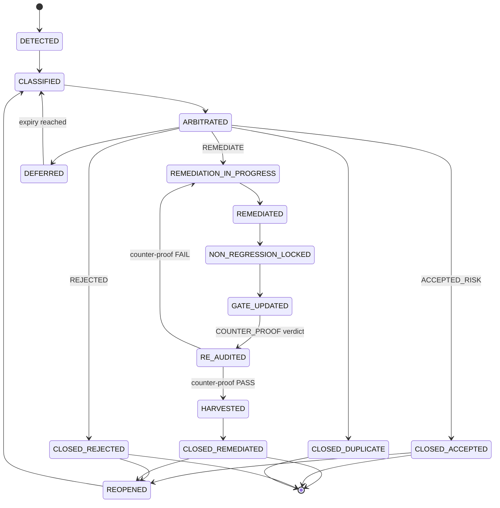

# Adversarial Assurance Governance

## Versioned A2/A3 clarification (v1.2)

This clarification is adopted by ADR 0053 and applies only to runs that
declare `adversarial_governance_version: "1.2"` (or the explicitly marked
`1.2-proposed` transition profile). Runs governed by v1.1 retain their
original meaning and are never reinterpreted retroactively. ADR 0051 remains
the historical foundational decision for the adversarial assurance dimension;
ADR 0053 records the v1.2 alignment and does not rewrite ADR 0051.

- `A1` is bounded internal self-adversarial review.
- `A2` is adversarial review with verifiable operational isolation. At
  minimum the run records a distinct session, fresh context, explicit
  adversarial role, non-exposure of defender conclusions, preserved inputs,
  preserved raw transcript, independently produced findings, declared scope,
  and observed runtime identity.
- `A3` is strengthened external independence. It requires the A2 isolation
  evidence plus an independently controlled actor/environment and evidence
  that the producer has no control over the review. Human, organization,
  provider, model, and environment are transparency metadata unless the A3
  profile explicitly makes one a blocking criterion.

Model and provider identity are therefore disclosure metadata for A2. They do
not substitute for operational isolation and do not make an A2 run an A3 run.
Missing isolation evidence fails closed. Historical v1.1 verdicts remain true
under v1.1; a new run may explicitly re-evaluate them under v1.2.

This document is the **single authority** for the adversarial assurance
*domain*: the three criticality levels, the four declared statuses, the
finding lifecycle, the verdict conditions, the corpus contract, and the
promotion matrix.

The **schema** for `ASSURANCE_STATUS` v1.1 (the field set, the enum values,
the checkpoint aggregation) remains in `docs/GATE_ASSURANCE_GOVERNANCE.md`
§Schema 1.1. That document is the authority on the *shape* of the record;
this document is the authority on the *meaning* of the values.

Per CR#5 (`AGENTS.md`), no parallel truth exists between the two. Cross-
references are mandatory: any update to a value's semantics here must
trigger a schema compatibility check there, and vice versa.

## Foundational principle — Adversarial assurance as falsification duty

Vibebackbone answers two questions about a delivery:

1. *Does the delivery conform to what was declared?* — answered by
   `conformity_status` and the Design / Certification gate families.
2. *Was the delivery subjected to a declared attack, at a declared
   depth, by a declared actor, and what remains unexplored?* — answered
   by `adversarial_status` and the Adversarial gate family.

The first question (confirmatory) is the cycle's primary mode. The second
question (falsification) is the new dimension added by ADR 0051. They are
*additive*: the cycle still passes a conforming delivery even in the
absence of adversarial work, but the new dimension is the difference
between "verified" and "never attacked".

`PASS_ADVERSARIAL` is **bounded evidence**, not proof. It declares what
was tried, at what depth, by whom, and what was left untried. Absence of
finding is not the same as presence of correctness — the non-claim of
§6.2 is part of the verdict.

## §1 — Three adversarial levels

The level drives the depth of exploration required for
`PASS_ADVERSARIAL`. Undeclared, ambiguous, or contested criticality
defaults to `A1` (fail-closed).

| Level | Exploration required | Regression corpus | Actor | Human decision | Counter-proof |
|---|---|---|---|---|---|
| `A0` | none (declared with reason) | yes, always | n/a | no | n/a |
| `A1` | bounded — changed surface + immediate blast radius | yes | disclosed self-adversarial permitted, pre-registered attack list mandatory | no | required iff any finding is confirmed |
| `A2` | full declared attack-surface classes plus v1.2 operational-isolation evidence | yes | **operational isolation** (v1.2; v1.1 historical profile remains distinct-actor) | **mandatory** | **mandatory** |
| `A3` | A2 plus strengthened external independence | yes | **independent external actor/environment** | **mandatory** | **mandatory, external independence** |

### §1.1 — `A0` exclusion rule

In an agent-governed repository, governance documents, prompts, skills
and templates *are* the runtime for agents. Any change under `AGENTS.md`,
`SYSTEM.md`, `docs/PILOTAGE.md`, `docs/templates/`, `prompts/`, `skills/`,
or any `distributions/` path is **never `A0`** — minimum `A1`.

This rule exists because the highest-leverage behavior surface in an
agent-governed repository is the documents that *steer* agents. Treating
them as documentation-only would systematically route the most impactful
changes to the no-exploration level.

#### §1.1.1 — `level_reason` field (mandatory for `A0`)

When the declared level is `A0`, the closeout **must** carry a
non-empty `level_reason` field (gate `adv-a0-reason`, S1) explaining
why the run is exempt from adversarial exploration. This field is the
mechanical justification for the absence of exploration and must be
preserved across templates, prompts, validators, and tests.

The field is:

- **Mandatory** when `level == "A0"` (gate `adv-a0-reason`, severity S1)
- **Absent** for `A1` and `A2` (not enforced)
- A free-form string; the validator only checks non-emptiness
- Documented in `docs/templates/01_INTAKE.md.template` and
  `docs/templates/07_CLOSEOUT.md.template` as `<required when level=A0>`

The `level_reason` field was added by M3-03 to close the
documentary contradiction between templates (which required it) and
the canon (which was silent). R2 §3 (ADVR-A2-02) recorded this as a
`CONTRADICTION_DOCUMENTAIRE` of severity S2; M3-03 closes it.

### §1.2 — Criticality matrix triggers

Evaluated at intake, re-evaluated at execution end.

| Trigger | Level |
|---|---|
| Authentication, authorization, session, permission boundary | `A2` |
| Secrets, credentials, key material, token lifecycle | `A2` |
| Data integrity, migration, deletion, retention, backup/restore | `A2` |
| Money, billing, quota, accounting | `A2` |
| Published contract consumed by another repository or distribution | `A2` |
| Concurrency, transaction boundary, ordering, idempotency, retry | `A2` |
| Deployment, rollback, release, production state | `A2` |
| Governance canon that gates other work (`AGENTS.md`, `SYSTEM.md`, `PILOTAGE.md`, gate tools, review profiles) | `A2` |
| Subject with an existing `S0`/`S1` finding history in the last `N=10` runs | `A2` |
| Any subject for which `CERTIFIED` will be claimed | `A2` |
| Observable behavior change on a single internal surface | `A1` |
| Internal contract, tool, CLI, schema-adjacent change | `A1` |
| Prompt, skill, or template change that steers agent behavior | `A1` |
| Test-surface change (including corpus entries themselves) | `A1` |
| Dependency bump with behavior surface | `A1` |
| Undeclared, ambiguous, or contested criticality | `A1` (fail-closed) |
| Pure documentation with no agent-steering effect, no contract, no behavior, no data path | `A0` |
| Formatting, renaming with no reference change, typo fix | `A0` |

### §1.3 — Route interaction

| Route | Permitted levels |
|---|---|
| `FAST-ZERO` | `A0` only (by construction of the route) |
| `FAST-MINIMAL` | `A0`, `A1` |
| `FAST` | `A0`, `A1` — an `A2` trigger forces escalation to `STRUCTURED`/`AUDIT` (P.R7) |
| `STRUCTURED` | `A0`, `A1`, `A2` |
| `AUDIT` | `A1`, `A2` |

## §2 — Finding lifecycle



### §2.1 — Severity scale

| Severity | Definition | Blocking effect |
|---|---|---|
| `S0` | Exploitable integrity, security, data-loss, or canon-breaking defect; or silent corruption | Blocks `PASS_ADVERSARIAL`, `CERTIFIED`, and merge |
| `S1` | Observable behavior incorrect within declared scope under realistic conditions | Blocks `PASS_ADVERSARIAL` and `CERTIFIED` |
| `S2` | Robustness gap under adverse but plausible conditions | Blocks `CERTIFIED` at `A2` unless human-approved `ACCEPTED_RISK`; recorded at `A1` |
| `S3` | Latent, hardening, or quality-of-evidence gap | Recorded; never blocking |

Confidence is a separate axis: `CONFIRMED`, `PLAUSIBLE`, `REFUTED`. Only
`CONFIRMED` findings block. A `PLAUSIBLE` finding must be promoted or
refuted before the campaign concludes at `A2`.

### §2.2 — Authority for arbitration (severity-dependent)

| Severity | Who may arbitrate the disposition | Agent may |
|---|---|---|
| `S0` | Human only | Propose, never decide |
| `S1` | Human only | Propose, never decide |
| `S2` | Agent may decide `REMEDIATE`; `ACCEPTED_RISK` and `REJECTED` require a human | Decide only toward more work, never less |
| `S3` | Agent may decide any disposition, recorded and reviewable | Full |

The asymmetry is deliberate: an agent may always escalate work, and may
never unilaterally reduce assurance. This mirrors ADR 0049 §Roles ("Only
a human approves, rejects, narrows or defers").

### §2.3 — Hard rules

1. **No closure without evidence.** `CLOSED_REMEDIATED` requires remediation
   *and* a non-regression lock *and* a `COUNTER_PROOF` PASS.
2. **Refuted findings are kept.** Negative evidence prevents re-litigation.
3. **One register.** Finding records are the single source of truth.
   `docs/AUDIT_STATUS.md` becomes a generated view over them.
4. **Accepted risk is time-bounded.** `expiry`, `owner`, `reopen_trigger`,
   and human approval are mandatory; expiry reaching returns the finding to
   `CLASSIFIED`.
5. **Detection mode is recorded.** It is the mechanical basis for
   distinguishing exploration from regression.

## §3 — v1.1 compatibility profile — `A2_DISTINCT_AGENT_PROXY`

The following profile remains normative for v1.1 runs and historical evidence.
For v1.2 runs, the versioned clarification at the top of this document is
the applicable A2 rule; the proxy remains a transparency and external-review
mechanism, not an A3 claim.

When `A2` is required but no genuinely distinct human actor is available
(solo-maintained repositories), `A2_DISTINCT_AGENT_PROXY` is permitted.

```yaml
A2_DISTINCT_AGENT_PROXY:
  requirements:
    attacker_identity_disclosure: MANDATORY
    distinct_llm: MANDATORY
    distinct_system_prompt: MANDATORY
    cross_validation: REQUIRED
  external_review:
    cadence: QUARTERLY
    operator_constraint: "different llm family OR human"
    failure_mode: "next CERTIFIED claim must wait for external_review pass"
  incompatible_with:
    - "downshift silencieux A2 -> A1"
    - "identity_disclosure absent"
```

The proxy publishes three identity disclosures in each finding record:

```yaml
adversarial:
  attacker_identity:
    agent: "<name>"
    llm: "<model id>"
    system_prompt_version: "<hash>"
```

These three fields are falsifiable by any reader: a subsequent review
can verify that they are distinct from the defender's identities and
that the system prompt version is non-derived.

A silent downshift `A2 → A1` is **forbidden** — that would defeat the
purpose of declaring `A2`.

## §4 — Triggers, N, and contest

### §4.1 — Window N

`N = 10` runs. The trigger `Subject with an existing S0/S1 finding
history in the last N runs` uses this window. The number is fixed —
not a qualitative threshold — so that the classifier is deterministic
and verifiable.

### §4.2 — "Contested" classification

A classification is contested when a named gate expert files a written
objection in `01_INTAKE.md` of the run, naming the trigger that was
misclassified and the rationale. The objection is detected mechanically
by `tools/vbb-gate-check.py` via a `contest_register` field in
`01_INTAKE.md`. A contested classification defaults to `A1` until
resolved, regardless of the original declaration.

### §4.3 — Fail-closed rules

| Situation | Effective level |
|---|---|
| Niveau déclaré `A2`, déclencheur `A2` matche, contest absent | `A2` |
| Niveau déclaré `A2`, déclencheur `A1` matche | `A2` (avec contest ouvert par défaut) |
| Niveau déclaré `A1`, déclencheur `A2` matche | **escalade obligatoire** vers `A2` |
| Niveau non déclaré | `A1` |
| Niveau déclaré `A0` mais déclencheur `A1`/`A2` matche | **escalade obligatoire** vers le niveau du trigger |
| Niveau contesté | `A1` jusqu'à résolution |
| Conflit déclarant / classifier automatique | `A1` (le plus prudent) |

Escalation is mandatory in the *more prudent* direction, never in the
*more lenient* direction. This is symmetric with the severity-dependent
arbitration authority of §2.2.

## §5 — Verdict conditions

Every condition is individually evidenced. Absent, malformed or
unevidenced conditions yield the fail-closed default.

### §5.1 — `PASS_CONFORMITY` requires ALL of:

1. `implementation_status` is `IMPLEMENTED` (or `NOT_APPLICABLE` with a
   declared profile for non-delivery subjects).
2. Every acceptance criterion and DoD item declared in `01_INTAKE` /
   `04_PLAN` is verified, each with named evidence.
3. Every required `DESIGN`-family gate result is `PASS` at its checkpoint.
4. The P.R2 pre-merge loop exits 0 on the same code state as the claim
   (cf. `docs/REFERENCE/pre-merge-gate.md`).
5. `tools/vbb-loop-closure-check.py <run> --strict` exits 0.
6. No open finding whose `class` is `CONTRACT` and whose severity is
   `S0`/`S1`.
7. The credentials gate passes (per ADR 0033).

**Non-claim.** `PASS_CONFORMITY` states that declared contracts hold on
a declared surface. It says nothing about undeclared surfaces, adverse
conditions, or the sufficiency of the contracts themselves.

### §5.2 — `PASS_ADVERSARIAL` requires ALL of:

1. An adversarial campaign record exists for the subject, at the
   required level (§1), declaring: scope, attack-surface classes,
   techniques, oracles, depth or effort bound, stop criteria, and actor.
2. `exploration_performed: true` for `A1`/`A2` — corpus execution alone
   never satisfies this.
3. The applicable regression corpus was executed on the code state under
   assurance, with 100% of applicable entries passing, and the corpus
   version is recorded.
4. Every finding is in a terminal lifecycle state, or is `S3` and
   recorded.
5. No `CONFIRMED` finding at `S0` or `S1` is unremediated; at `A2`, no
   `CONFIRMED` `S2` is unremediated without human-approved `ACCEPTED_RISK`.
6. Every `PLAUSIBLE` finding has been promoted to `CONFIRMED` or
   `REFUTED` at `A2`.
7. Every remediated finding carries a non-regression lock with
   `fails_before: true` and `passes_after: true`.
8. Every remediated finding has a `COUNTER_PROOF` gate result with
   verdict `PASS`, produced after the remediation. For v1.2 `A2`, the
   counter-proof must satisfy the declared operational-isolation evidence;
   v1.1 runs retain the historical distinct-actor profile, and `A3` requires
   strengthened external independence.
9. `surfaces_unexplored` is declared and non-omitted. An empty list is
   legal only with explicit justification that the declared surface was
   exhaustively covered.
10. The campaign's `residual_uncertainty` statement is present.

**Mandatory non-claim.** The literal text below is part of the verdict,
not commentary:

> `PASS_ADVERSARIAL` means: *a declared attack surface was exercised at
> a declared depth by a declared actor, and no unremediated confirmed
> finding remains within that scope.* It does **not** mean the subject
> is correct, secure, or free of defects. Absence of finding is bounded
> evidence, never proof.

### §5.3 — `CERTIFIED` requires ALL of:

This is a conjunction of named conditions (D6 — no aggregate, no average,
no rollup). Each is bound to one code state (`run_id` + commit +
`corpus_version` + declared scope + date).

#### §5.3.0 — Separation of validator responsibilities

The 13 conditions below are **not** all validated by the same
validator. Responsibilities are split between three surfaces:

- **`vbb-adversarial-gate.py`** (this document's primary tool) owns
  conditions `6.3.1`, `6.3.2`, `6.3.8`, `6.3.9`, `6.3.13` — those
  derivable mechanically from the `07_CLOSEOUT.md` file (the
  `adversarial` block, the findings, and the certification block).

- **A future `vbb-certification-monitor`** (or its current equivalent,
  the `vbb-status-dashboard` certification-state report plus the
  `vbb-loop-closure-check` SLA breach detection) owns conditions
  `6.3.10` (`revocation_mechanism` declared), `6.3.11` (cadence ≤ 90
  days), `6.3.12` (`last_reviewed` within cadence). These depend on
  runtime state, not just the closeout file.

- **Run-level closure** (cross-validated at `COUNTER_PROOF`) owns
  conditions `6.3.3`, `6.3.4`, `6.3.5`, `6.3.6`, `6.3.7`.

The full chain **must** be fail-closed (§6 SLA breach flow): a
monitoring surface that finds a missing or expired runtime check
(e.g., `revocation_mechanism` declared but never executed) does
**not** allow a `CERTIFIED` to be emitted. The monitor emits an
alert and `vbb-loop-closure-check` fails the closure invariant.

#### §5.3.1 — `CERTIFIED` conditions (13 total, IDs reused)

1. `conformity_status` ∈ {`PASS_CONFORMITY`, `NOT_APPLICABLE` avec profil}.
2. `adversarial_status` ∈ {`PASS_ADVERSARIAL`, `NOT_REQUIRED` (A0 valide +
   aucun trigger A1/A2)}.
3. Every required `CERTIFICATION`-family gate result is `PASS` at the
   `CLOSEOUT` checkpoint.
4. Every `POST_IMPLEMENTATION` required `FAIL` carries a `resolution`
   whose closing result is `PASS` at the `COUNTER_PROOF` checkpoint and
   references the finding identifiers.
5. The Knowledge Harvest disposition is recorded, and every
   `CONFIRMED` finding has an answered `promotion` block (§7).
6. Every `ACCEPTED_RISK` in scope has owner, expiry, reopen trigger
   and human approval, and none has expired.
7. A human decision record exists for `A2` subjects
   (or the `A2_DISTINCT_AGENT_PROXY` proxy contract is satisfied).
8. The certification is bound: `run_id`, commit or content hash of the
   subject, `corpus_version`, declared scope, and date are all recorded.
9. `implementation_authorization.status` is `AUTHORIZED` per ADR 0050
   §Explicit fail-closed authorization, for subjects that included
   implementation.
10. `certification.revocation_mechanism` is declared (monitor
    responsibility per §5.3.0) — format `manual:<cadence>`,
    `cron:<expr>`, or `webhook:<target>`.
11. The declared cadence is ≤ 90 days (monitor responsibility).
12. `certification.last_reviewed` is within the declared cadence
    (monitor responsibility, triggers §6 SLA breach).
13. For every `CONFIRMED` finding at level `A2`, the non-regression lock
    has `witnessed_by` (distinct from `discovered_by`) and `test_review`
    (PASS|FAIL verdict by second agent or human) populated.

## §6 — Revocation (loss of `CERTIFIED`)

`CERTIFIED → SUSPENDED` when ANY of:

1. A new `CONFIRMED` finding lands in the certified scope.
2. The `corpus_version` changes in a way that affects the certified surface.
3. The declared scope changes.
4. An `ACCEPTED_RISK` expires without renewal.
5. A reopen trigger fires.
6. The `certification.owner` SLA breach (§7) — `now - last_reviewed >
   cadence` — fires.

The historical certification record itself remains valid for its bound
state. Revocation monitoring is owned by `certification.owner` (§7).

Certification never expires by time alone; it expires by **state
divergence**. The canonical non-claim is that the historical record
preserves its truth for its bound state.

## §7 — `certification.owner`

### §7.1 — Responsibilities

(a) Monitor the 6 revocation triggers of §6.
(b) Maintain `certification.last_reviewed`.
(c) Trigger the transition `CERTIFIED → SUSPENDED` on detection.
(d) Maintain `certification.last_external_review` when applicable (cf. §3
    `A2_DISTINCT_AGENT_PROXY`).

### §7.2 — Mechanism

Three modes are authorised. If none is declared, the default is
`manual:quarterly`.

| Mode | Format | Cadence rule |
|---|---|---|
| `manual` | `manual:<cadence>` | `now - last_reviewed ≤ cadence` |
| `cron` | `cron:<expr>` | `cron` expression must have periodicity ≤ 90 days |
| `webhook` | `webhook:<target>` | target must emit a signal within 90 days |

### §7.3 — SLA breach

If `now - last_reviewed > cadence`, OR if a `webhook` target has not
emitted a signal for 90 days, the next pass of
`tools/vbb-status-dashboard.py` (or `tools/vbb-loop-closure-check.py`)
triggers an automatic transition `CERTIFIED → SUSPENDED`.

This is the only way to prevent the silent inertia that the
absence-of-mechanism design risk identified.

### §7.4 — Re-acquisition

Re-acquisition requires re-execution of all 13 conditions of §5.3 and
release of the cause of suspension. The new certification receives a
new `bound_to.run_id`. The historical record's `bound_to` is preserved.

## §8 — Verdict conditions vs. aggregation

Two distinct evaluations are defined. No implementation may collapse
them into a single number.

| Evaluation | Scope | Effect of `resolution` |
|---|---|---|
| `checkpoint_aggregation` | Per checkpoint | **None.** `POST_IMPLEMENTATION` stays `FAIL` forever if a `FAIL` was logged. That is the historical truth. |
| `closure_evaluation` | Per run, at closeout | A `POST_IMPLEMENTATION` required `FAIL` stops blocking closure **iff** it carries a valid `resolution` whose closing gate result is `PASS` at `COUNTER_PROOF`. |

A run may therefore final-close while permanently displaying a failed
`POST_IMPLEMENTATION` checkpoint. The record reads "this broke once,
here is the proof it was closed", not "this never broke".

## §9 — Promotion matrix

Every `CONFIRMED` finding must produce an **explicit answer for all six
destinations**. `NOT_APPLICABLE` is legal; silence is not. The matrix
applies regardless of severity.

| # | Destination | Rule |
|---|---|---|
| 1 | Canonical test (`tests/`) | Required when defect is reproducible at unit or contract level |
| 2 | Integration test | Required when defect only appears across components or at runtime |
| 3 | Certification gate | Required when the defect class can recur undetected by tests — becomes a new `gate_id` or a new check in a `vbb-*.py` validator |
| 4 | Checklist | Required when detection depends on human or agent judgment — pre-merge, closeout, or review-profile checklist item |
| 5 | Normative rule | Only through ADR 0049: OBSERVATION → CANDIDATE → KNOWLEDGE AUDIT → INDEPENDENT REVIEW → HUMAN DECISION → CANONICAL. **No direct edit of `CONVENTIONS.md` or `AGENTS.md` from a finding.** |
| 6 | Adversarial corpus | **Mandatory** for every `CONFIRMED` finding, no exception |

## §10 — Compatibility and cutoff

```yaml
adversarial_governance_version: "1.1"
cutoff_run_key: "2026-07-28_1400"
cutoff_timestamp: "2026-07-28T14:00:00Z"
```

- At or after the cutoff: runs declare
  `adversarial_governance_version: "1.1"` in intake/closeout and carry
  a valid `adversarial` block, or a valid `A0` declaration.
- Before the cutoff: runs remain valid under their original protocol.
  Readers prefer v1.1 semantics when present and preserve legacy
  semantics when absent.
- `UNASSESSED_LEGACY` is the value of `certification_status` for
  pre-cutoff subjects that were never adversarially assessed. It is
  **distinct from `NOT_CERTIFIED`** and is **not a failure**.

## §11 — Transient bootstrap statuses (RATIFIED 2026-07-28)

Two new values of `certification_status` are introduced to handle
the post-cutoff bootstrap phase, when the validator
(`tools/vbb-adversarial-gate.py`) is not yet available to deliver
`PASS_ADVERSARIAL`. Per R1 (2026-07-28_1800) and the human ratification
of REM-01, the third candidate `SELF_HOSTING` was **not retained**.

### §11.1 — `PRE_CERTIFICATION`

**Definition.** The subject is post-cutoff, has never been
`CERTIFIED`, and the absence of certification is *documented and
assumed* (not a failure). The subject may still be `PASS_CONFORMITY`
and used in runtime.

**Applicability.** Vibebackbone itself (its own canon post-cutoff),
consumer projects at their first run after adopting v1.1.

**Required evidence (all three):**

```yaml
certification:
  status: PRE_CERTIFICATION
  transient_reason: "<human-readable reason>"
  bootstrapped_at: "ISO8601 UTC"
  bootstrapped_by: "<agent or human identifier>"
```

**Mandatory non-claim.** A subject in `PRE_CERTIFICATION` is not
promised to be correct, secure, or fit for production. The status
documents an explicit *gap*, not a *quality claim*.

**Transition out.** A subject in `PRE_CERTIFICATION` transitions to:

- `CERTIFIED` — once all 13 conditions of §5.3 hold and the
  validator (`vbb-adversarial-gate.py`) is available.
- `NOT_CERTIFIED` — if the subject is no longer a candidate for
  certification (e.g., deprecated).
- `MIGRATION` — if the subject is migrating to a new governance
  version before certification is achieved.

A subject may remain in `PRE_CERTIFICATION` indefinitely. The status
is **not** a violation of P.R7 (escalation on risk class change); it
is an *honest declaration* that the certification work has not yet
been performed.

### §11.2 — `MIGRATION`

**Definition.** The subject is in active transition between two
governance regimes (e.g., v1.0 → v1.1). The subject remains
operational during the migration; the transition is in progress.

**Applicability.** Consumer projects adopting v1.1; subjects whose
governance version is being upgraded.

**Required evidence:**

```yaml
certification:
  status: MIGRATION
  migrating_from: "v1.0"
  migrating_to: "v1.1"
  migration_started_at: "ISO8601 UTC"
  migration_plan_ref: "<run_id or document path>"
  migration_completion_deadline: "<ISO8601 UTC, ≤ 90 days>"
```

**Transition out.** A subject in `MIGRATION` transitions to:

- `CERTIFIED` — once migration completes and all 13 conditions hold.
- `PRE_CERTIFICATION` — if migration completes before first
  certification is achieved.
- `NOT_CERTIFIED` — if migration fails or is abandoned.

### §11.3 — Distinction matrix

| Status | Domain | Meaning | Failure? |
|---|---|---|---|
| `UNASSESSED_LEGACY` | pre-cutoff | subject existed before the rule; never re-assessed; not retroactively certifiable | No |
| `PRE_CERTIFICATION` | post-cutoff, pre-validation | subject exists after the rule; awaits first CERTIFIED; gap is documented | No |
| `MIGRATION` | version transition | subject is moving between regimes; transition in progress | No (if respecting §7.2 cadence) |
| `NOT_CERTIFIED` | post-cutoff, evaluated | subject has been evaluated and does not (yet) hold CERTIFIED | **Yes** — *evaluated and failed or never passed* |
| `CERTIFIED` | post-cutoff, certified | subject holds all 13 conditions | No |
| `SUSPENDED` | post-cutoff, was CERTIFIED | subject lost CERTIFIED via one of the 6 triggers | Yes (transient) |
| `NOT_APPLICABLE` | subject out of scope | certification is not applicable to this subject | No |

### §11.4 — Validator interaction

`tools/vbb-adversarial-gate.py` accepts `PRE_CERTIFICATION` and
`MIGRATION` as **non-blocking** statuses. They do not affect
`PASS_ADVERSARIAL` validity. The validator emits an `INFO` log when
it sees either, documenting that the subject is in a bootstrap phase.

`vbb-loop-closure-check.py` accepts the corresponding
`certification_status` value in `ASSURANCE_STATUS` blocks without
FAIL.

### §11.5 — Why `SELF_HOSTING` was not retained

R1 explicitly considered and rejected `SELF_HOSTING` as a third
candidate. The rationale: the term conflates *bootstrap* (the
moment when a tool is missing) with *hosting* (a permanent
architectural choice). Vibebackbone's actual situation is
*bootstrap*, captured by `PRE_CERTIFICATION`. If a future need for
a *permanent* self-hosting regime emerges, it should be debated
separately and **not** be conflated with the bootstrap status.

## References

- ADR 0051 (this ADR is the gate family charter)
- ADR 0050 (schema authority — `ASSURANCE_STATUS` v1.1 + check-
  points; the *shape* of the record)
- ADR 0049 (knowledge governance — promotion path)
- ADR 0043 (orthogonal runtime vs. assurance status)
- ADR 0031 (autonomous-run sequences — interaction noted)
- ADR 0033 (credentials gate — interaction preserved)
- `docs/GATE_ASSURANCE_GOVERNANCE.md` §Schema 1.1 (schema)
- `docs/PILOTAGE.md` §Triage rule (level declaration)
- `docs/CONVENTIONS.md` P.R5 (regression prevention first)
- `docs/ENGINEERING_KNOWLEDGE_GOVERNANCE.md` (knowledge loop)
- `docs/REFERENCE/pre-merge-gate.md` (corpus as distinct check)
- `docs/runs/2026-07-28_1002_adversarial-loop-governance-design/` (M0)
- `docs/runs/2026-07-28_1200_m1-adversarial-loop-normative-arbitration/` (M1)
- `docs/runs/2026-07-28_1400_m2-adversarial-loop-implementation/` (M2)
