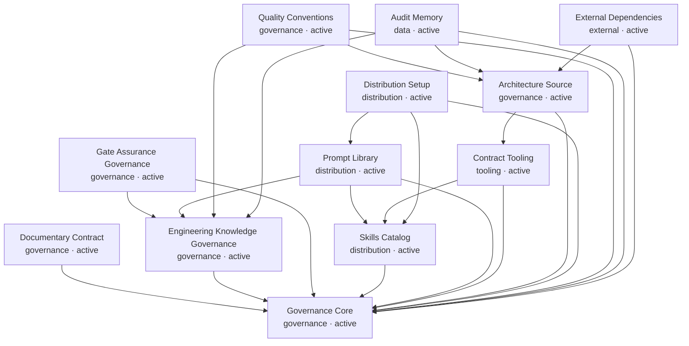

# RELATIONS — Architecture Projection

> Generated from `docs/ARCHITECTURE.md` by `tools/vbb-architecture.py graph --write`.
> Do not edit this file as the source of truth.

## Dependency Graph

## Sensitive Zones

| Block | Risks |
|-------|-------|
| `documentary-contract` | DOC-001: Unqualified artefacts must remain UNKNOWN and historical evidence must not become current authority. |
| `engineering-knowledge-governance` | KNO-001: A candidate, playbook or run can create parallel truth if treated as authority.; KNO-002: Scope inflation can promote evidence beyond the independence it demonstrates. |
| `gate-assurance-governance` | ASR-001: Misclassifying a behavioral contradiction as Certification can preserve a false Design PASS.; ASR-002: Inferring authorization from PASS verdicts can bypass required gates. |
| `skills-catalog` | SKILL-001: Contract index drift reduces route and runtime coverage. |
| `contract-tooling` | TOOL-003: Credentials enforcement is shared by the staged hook and commit-range CI through tools/vbb-credentials-gate.py (ADR-0033); detection is differential and intentionally not exhaustive.; TOOL-005: Effective readiness conservatively combines documentary truth with local Git, source-integrity and explicitly parsed open-risk measurements; missing, invalid or contradictory risk sources are UNKNOWN/blocking, and each result exposes the exact repository SHA (ADR-0046, RR-BK-05). |
| `architecture-source` | ARCH-001: The projection must never become a competing source of truth. |
| `distribution-setup` | SETUP-001: Adapter counts can diverge from canonical catalog counts.; SETUP-002: Runtime destinations must never be followed into Core sources; Codex migration and uninstall enforce this boundary under ADR-0046. |

## Impact Index

| Block | Depends on | Impacts | Files |
|-------|------------|---------|-------|
| `governance-core` | - | task triage, audit routing, session startup, session closeout, engineering knowledge promotion | `AGENTS.md`, `SYSTEM.md`, `docs/CONTEXT.md`, `docs/PILOTAGE.md`, `docs/PROJECT_MODE.md`, `docs/SESSION_RULES.md`, `docs/CONVENTIONS.md`, `skills/vibebackbone/**` |
| `documentary-contract` | `governance-core` | document authority, documentary transitions, agent startup and routing, source and projection provenance | `docs/document-model/DOCUMENT_IDENTITY_MODEL.md`, `docs/document-model/DOCUMENT_ONTOLOGY.md`, `docs/document-model/DOCUMENT_GRAPH_MODEL.md`, `docs/document-model/DOCUMENT_TAG_SPECIFICATION.md`, `docs/document-model/DOCUMENT_TRANSITION_PROTOCOL.md`, `docs/document-model/DOCUMENT_MODEL_REFERENCE_ARCHITECTURE.md`, `.vbb/document-convention.yaml` |
| `engineering-knowledge-governance` | `governance-core` | audit routing, decision authority, independent review, session closeout, canonical change integration, knowledge record lifecycle | `docs/ENGINEERING_KNOWLEDGE_GOVERNANCE.md`, `docs/templates/KNOWLEDGE_RECORD.md.template` |
| `gate-assurance-governance` | `governance-core`, `engineering-knowledge-governance` | pre-implementation gates, independent review, implementation authorization, closeout, four-distribution governance | `docs/GATE_ASSURANCE_GOVERNANCE.md`, `docs/templates/01_INTAKE.md.template`, `docs/templates/04_PLAN.md.template`, `docs/templates/06_REVIEW.md.template`, `docs/templates/07_CLOSEOUT.md.template`, `prompts/canonical/06-p-vbb-review.md`, `prompts/canonical/07-p-vbb-closeout.md`, `tools/vbb-loop-closure-check.py` |
| `skills-catalog` | `governance-core` | route execution, audit skills, structured task support | `skills/*/SKILL.md`, `skills/*/CONTRACT.yaml`, `skills/INDEX.yaml`, `docs/REFERENCE/scoped-audit-protocol.md` |
| `prompt-library` | `governance-core`, `skills-catalog`, `engineering-knowledge-governance` | session entry, user-facing workflow selection, provider command generation | `prompts/*.md`, `prompts/canonical/*.md`, `PROMPTS_ARCHITECTURE.md` |
| `contract-tooling` | `skills-catalog`, `governance-core` | CI confidence, release readiness, implementation-readiness audits | `pyproject.toml`, `requirements-dev.txt`, `tools/vbb-contract-lint.py`, `tools/vbb-contract-runtime.py`, `tools/vbb-executor.py`, `tools/vbb-phase-router.py`, `tools/vbb-project-init.py`, `tools/vbb-status-dashboard.py`, `tools/vbb-loop-closure-check.py`, `tools/vbb-gate-check.py`, `tools/vbb-credentials-gate.py`, `tools/vbb_run_resolution.py`, `tools/vbb_runtime_conformance.py`, `conformance/**`, `scripts/hooks/pre-commit-framework-gate`, `scripts/install-vbb-hooks.sh` |
| `architecture-source` | `governance-core`, `contract-tooling` | dependency mapping, refactoring impact analysis, sensitive zone visualization, agentic coding framing | `docs/ARCHITECTURE.md`, `docs/RELATIONS.md`, `docs/adr/*.md`, `docs/PILOTAGE.md`, `tools/vbb-architecture.py`, `tests/test_vbb_architecture.py`, `scripts/vbb-ci-local.sh`, `.github/workflows/vbb-contracts.yml`, `skills/t-vbb-dependency-mapper/SKILL.md`, `skills/t-vbb-impact-analyzer/SKILL.md` |
| `distribution-setup` | `governance-core`, `skills-catalog`, `prompt-library` | Claude Code integration, Codex integration, Pi integration, OpenCode integration | `setup.sh`, `setup-lib.sh`, `core/setup.sh`, `distributions/claude/setup.sh`, `distributions/codex/setup.sh`, `distributions/pi/setup.sh`, `distributions/opencode/setup.sh`, `conformance/**`, `tools/vbb_runtime_conformance.py`, `tests/test_setup_smoke.sh`, `scripts/vbb-ci-local.sh`, `.github/workflows/vbb-contracts.yml`, `docs/DEPLOYMENT.md` |
| `quality-conventions` | `governance-core`, `architecture-source`, `engineering-knowledge-governance` | code readability standards, module organization, canonical change discipline, test quality, documentation standards, error handling consistency, invariant protection, regression prevention | `docs/CONVENTIONS.md`, `docs/templates/CANON_CHANGE_PROPOSAL.md.template`, `docs/runs/2026-05-29_1000_robustness-audit/ROBUSTNESS_AUDIT.md`, `docs/runs/2026-05-29_1000_robustness-audit/PILLAR_5_PROPOSAL.md` |
| `audit-memory` | `governance-core`, `architecture-source`, `engineering-knowledge-governance` | session resume, release readiness, implementation risk register | `docs/AUDIT_STATUS.md`, `docs/audits/*.md`, `docs/archive/**/*.md`, `docs/runs/**/*.md`, `docs/TEMPORAL_PROVENANCE.md`, `docs/TECH_DEBT.md`, `docs/templates/CANON_CHANGE_PROPOSAL.md.template` |
| `external-dependencies` | `governance-core`, `architecture-source` | impact analysis, cross-service coordination, install posture, supported-provider runtime posture | `docs/ARCHITECTURE.md`, `docs/DISTRIBUTIONS.md` |
