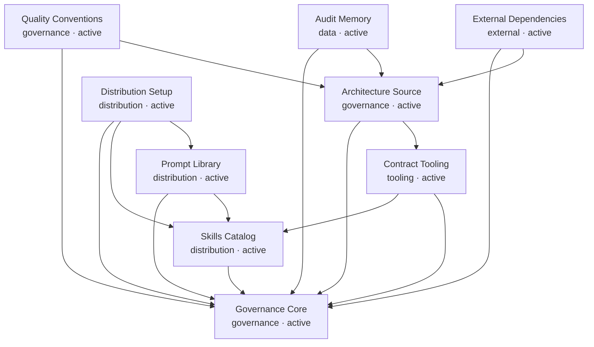

# RELATIONS — Architecture Projection

> Generated from `docs/ARCHITECTURE.md` by `tools/vbb-architecture.py graph --write`.
> Do not edit this file as the source of truth.

## Dependency Graph

## Sensitive Zones

| Block | Risks |
|-------|-------|
| `skills-catalog` | SKILL-001: Contract index drift reduces route and runtime coverage. |
| `architecture-source` | ARCH-001: The projection must never become a competing source of truth. |
| `distribution-setup` | SETUP-001: Adapter counts can diverge from canonical catalog counts. |

## Impact Index

| Block | Depends on | Impacts | Files |
|-------|------------|---------|-------|
| `governance-core` | - | task triage, audit routing, session startup, session closeout | `AGENTS.md`, `SYSTEM.md`, `docs/CONTEXT.md`, `docs/PILOTAGE.md`, `docs/PROJECT_MODE.md`, `docs/SESSION_RULES.md`, `docs/CONVENTIONS.md`, `skills/vibebackbone/**` |
| `skills-catalog` | `governance-core` | route execution, audit skills, structured task support | `skills/*/SKILL.md`, `skills/*/CONTRACT.yaml`, `skills/INDEX.yaml` |
| `prompt-library` | `governance-core`, `skills-catalog` | session entry, user-facing workflow selection, provider command generation | `prompts/*.md`, `prompts/canonical/*.md`, `PROMPTS_ARCHITECTURE.md` |
| `contract-tooling` | `skills-catalog`, `governance-core` | CI confidence, release readiness, implementation-readiness audits | `tools/vbb-contract-lint.py`, `tools/vbb-contract-runtime.py`, `tools/vbb-executor.py`, `tools/vbb-phase-router.py`, `tools/vbb-project-init.py`, `tools/vbb-status-dashboard.py` |
| `architecture-source` | `governance-core`, `contract-tooling` | dependency mapping, refactoring impact analysis, sensitive zone visualization, agentic coding framing | `docs/ARCHITECTURE.md`, `docs/RELATIONS.md`, `docs/adr/*.md`, `docs/PILOTAGE.md`, `tools/vbb-architecture.py`, `tests/test_vbb_architecture.py`, `scripts/vbb-ci-local.sh`, `.github/workflows/vbb-contracts.yml`, `skills/t-vbb-dependency-mapper/SKILL.md`, `skills/t-vbb-impact-analyzer/SKILL.md` |
| `distribution-setup` | `governance-core`, `skills-catalog`, `prompt-library` | Claude Code integration, Codex integration, Pi integration, OpenCode integration, Hermes/Cody integration (currently active orchestrator) | `setup.sh`, `setup-lib.sh`, `core/setup.sh`, `distributions/claude/setup.sh`, `distributions/codex/setup.sh`, `distributions/pi/setup.sh`, `distributions/opencode/setup.sh`, `distributions/hermes/setup.sh`, `distributions/hermes/proxy/`, `distributions/hermes/AGENT_INSTALL.md`, `distributions/hermes/install/INSTALL.md`, `tests/test_setup_smoke.sh`, `scripts/vbb-ci-local.sh`, `.github/workflows/vbb-contracts.yml`, `docs/DEPLOYMENT.md` |
| `quality-conventions` | `governance-core`, `architecture-source` | code readability standards, module organization, canonical change discipline, test quality, documentation standards, error handling consistency, invariant protection, regression prevention | `docs/CONVENTIONS.md`, `docs/templates/CANON_CHANGE_PROPOSAL.md.template`, `docs/runs/2026-05-29_1000_robustness-audit/ROBUSTNESS_AUDIT.md`, `docs/runs/2026-05-29_1000_robustness-audit/PILLAR_5_PROPOSAL.md` |
| `audit-memory` | `governance-core`, `architecture-source` | session resume, release readiness, implementation risk register | `docs/AUDIT_STATUS.md`, `docs/audits/*.md`, `docs/archive/**/*.md`, `docs/runs/**/*.md`, `docs/TEMPORAL_PROVENANCE.md`, `docs/TECH_DEBT.md`, `docs/templates/CANON_CHANGE_PROPOSAL.md.template` |
| `external-dependencies` | `governance-core`, `architecture-source` | impact analysis, cross-service coordination, install posture, security proxy posture (Hermes) | `docs/ARCHITECTURE.md`, `docs/DISTRIBUTIONS.md` |
