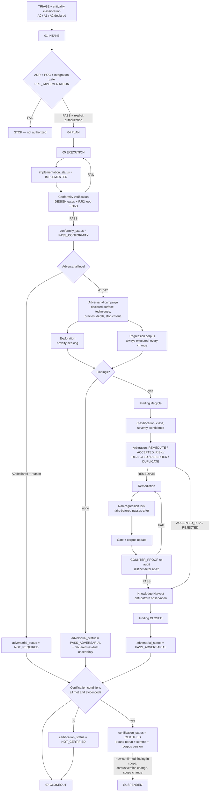
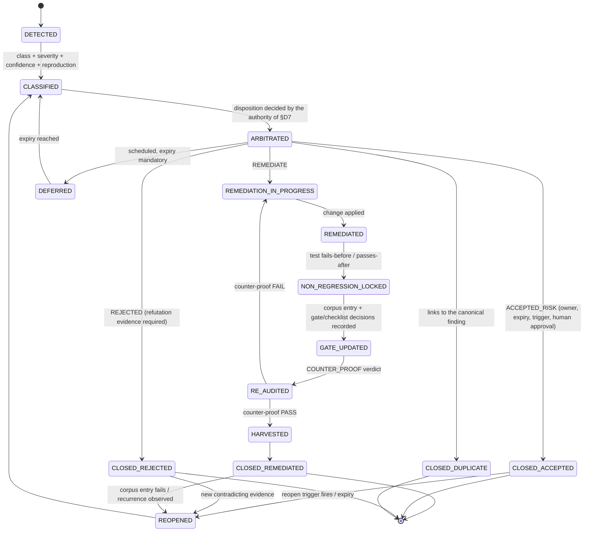

# 04_DESIGN_DOSSIER — Adversarial assurance governance, design v0.2

> **Status**: proposal. Nothing here is canonical. A separate governed run,
> with its own ADR, human decision and independent review, is required before
> any of this becomes normative.

**Version history**

| Version | Date | Change |
|---|---|---|
| 0.1 | 2026-07-28 | Initial design submitted to independent review |
| 0.2 | 2026-07-28 | Remediation of `ADVR-01` … `ADVR-10` from `06_INDEPENDENT_REVIEW.md` Run 01. Amended sections are marked **[R:ADVR-nn]** |

---

## 1. Principle

Vibebackbone currently answers one question well: *does the delivery conform to
what was declared?* It cannot answer a second: *did anyone try to break it, how
hard, and what remains unexplored?*

The proposal adds that second question as a **first-class, evidenced,
fail-closed dimension** — not as a new process branch, but as a new dimension
of the existing one.

Four claims become four separately declared statuses that never imply one
another:

```text
implementation_status   the change exists            ≠ it is correct
conformity_status       it matches its contracts     ≠ it resists
adversarial_status      it resisted a declared       ≠ it is proven correct
                        attack at a declared depth
certification_status    all of the above, bound to   ≠ permanent
                        one frozen code state
```

## 2. The two loops

### 2.1 Constructive loop (C)

Unchanged from today. Produces a delivery and verifies it against its declared
contracts.

```text
INTAKE → [ADR+POC gate] → DECISION → PLAN → EXECUTION
       → DESIGN gates → conformity verification → PASS_CONFORMITY
```

### 2.2 Adversarial loop (A)

New. Consumes a delivery that has reached `PASS_CONFORMITY` (or, at `A2`, may
start earlier against the design itself) and actively attempts to falsify it.

```text
CAMPAIGN SCOPING → EXPLORATION → FINDINGS → CLASSIFICATION → ARBITRATION
   → REMEDIATION → NON-REGRESSION LOCK → GATE UPDATE → COUNTER-PROOF RE-AUDIT
   → KNOWLEDGE HARVEST → CLOSURE → PASS_ADVERSARIAL
```

### 2.3 Full cycle diagram



**Reading the diagram.** The constructive loop is the left-to-right spine. The
adversarial loop is the block between `CAMP` and `CLOSE`. `REG` (regression)
enters from the mechanical test surface at every level, including `A0`;
`EXP` (exploration) only exists at `A1`/`A2`. Certification is a terminal
conjunction, and the dotted edge is the revocation path.

## 3. The four statuses

All four live inside `ASSURANCE_STATUS` (D1: no parallel block). Each carries
its own `evidence` list. **No status may be inferred from another**, and a
status without evidence is invalid, not merely undocumented **[R:ADVR-08]**.

### 3.1 `implementation_status`

| Value | Meaning |
|---|---|
| `NOT_STARTED` | No implementation attempted |
| `IN_PROGRESS` | Partially implemented; run cannot final-close |
| `IMPLEMENTED` | The planned change exists in the working state, per `04_PLAN` |
| `ABANDONED` | Deliberately stopped, recorded |

Default when absent or malformed: `NOT_STARTED`. Evidence: `05_EXECUTION.md`
plus the file list. This status is **not** a quality claim.

### 3.2 `conformity_status`

| Value | Meaning |
|---|---|
| `NOT_ASSESSED` | Default; fail-closed |
| `PASS_CONFORMITY` | All conditions in §6.1 hold |
| `FAIL_CONFORMITY` | At least one declared contract is violated |
| `NOT_APPLICABLE` | Requires an `applicability` mapping with `profile_id` and evidence, as in ADR 0050 |

### 3.3 `adversarial_status`

| Value | Meaning |
|---|---|
| `NOT_ASSESSED` | Default; fail-closed |
| `NOT_REQUIRED` | Level `A0` **explicitly declared with a reason**, and the declaration survived classifier verification |
| `IN_CAMPAIGN` | Campaign open; run cannot final-close |
| `FINDINGS_OPEN` | At least one finding is not in a terminal state |
| `FAIL_ADVERSARIAL` | A confirmed finding at or above the blocking severity is unremediated |
| `PASS_ADVERSARIAL` | All conditions in §6.2 hold |

### 3.4 `certification_status`

| Value | Meaning |
|---|---|
| `NOT_CERTIFIED` | Default; fail-closed. **Also the value for anything never assessed** |
| `CERTIFIED` | All conditions in §6.3 hold, bound to one code state |
| `SUSPENDED` | Was `CERTIFIED`; a revocation trigger fired |
| `NOT_APPLICABLE` | Declared profile, e.g. exploratory or throwaway subject |

**`UNASSESSED_LEGACY`** is a distinct value reserved for pre-cutoff subjects
(see `05_MIGRATION_STRATEGY.md` §3). It is not `NOT_CERTIFIED` and it is not a
failure **[R:ADVR-09]**.

## 4. Criticality → adversarial level matrix

### 4.1 Levels

| Level | Name | Exploration | Regression corpus | Actor independence | Human decision | Counter-proof |
|---|---|---|---|---|---|---|
| `A0` | NONE (declared) | none | **yes, always** | n/a | no | n/a |
| `A1` | TARGETED | bounded, changed surface + immediate blast radius | yes | disclosed self-adversarial permitted, pre-registered attack list mandatory | no | required if any finding was confirmed |
| `A2` | FULL | full declared attack-surface classes | yes | **distinct actor mandatory** | **mandatory** | **mandatory, distinct actor** |

### 4.2 Classification triggers

Any single match escalates. Evaluated at intake, re-evaluated at execution end.

| Trigger | Level |
|---|---|
| Authentication, authorization, session, permission boundary | `A2` |
| Secrets, credentials, key material, token lifecycle | `A2` |
| Data integrity, migration, deletion, retention, backup/restore | `A2` |
| Money, billing, quota, accounting | `A2` |
| Published contract consumed by another repository or distribution | `A2` |
| Concurrency, transaction boundary, ordering, idempotency, retry | `A2` |
| Deployment, rollback, release, production state | `A2` |
| Governance canon that gates other work (`AGENTS.md`, `SYSTEM.md`, `PILOTAGE.md`, gate tools, review profiles) | `A2` |
| Subject with an existing `S0`/`S1` finding history in the last N runs | `A2` |
| Any subject for which `CERTIFIED` will be claimed | `A2` |
| Observable behavior change on a single internal surface | `A1` |
| Internal contract, tool, CLI, schema-adjacent change | `A1` |
| Prompt, skill, or template change that steers agent behavior | `A1` |
| Test-surface change (including corpus entries themselves) | `A1` |
| Dependency bump with behavior surface | `A1` |
| **Undeclared, ambiguous, or contested criticality** | `A1` (fail-closed) |
| Pure documentation with no agent-steering effect, no contract, no behavior, no data path | `A0` |
| Formatting, renaming with no reference change, typo fix | `A0` |

**`A0` exclusion rule [R:ADVR-04].** In an agent-governed repository, "docs
only" is not automatically behaviorless: governance documents, prompts, skills
and templates *are* the runtime for agents. Any change under `AGENTS.md`,
`SYSTEM.md`, `docs/` governance authorities, `prompts/`, `skills/`,
`docs/templates/` or `distributions/` is **never `A0`** — minimum `A1`.

### 4.3 Route interaction

| Route | Permitted levels |
|---|---|
| `FAST-ZERO` | `A0` only (by construction of the route) |
| `FAST-MINIMAL` | `A0`, `A1` |
| `FAST-STANDARD` | `A0`, `A1` — an `A2` trigger forces escalation to `STRUCTURED`/`AUDIT` (P.R7) |
| `STRUCTURED` | `A0`, `A1`, `A2` |
| `AUDIT` | `A1`, `A2` |

An `A2` trigger discovered mid-run is a risk-class change: stop, reclassify,
escalate (Critical Rule 2, P.R7).

## 5. Canonical finding schema and lifecycle

### 5.1 Lifecycle state machine



### 5.2 Severity scale

| Severity | Definition | Blocking effect |
|---|---|---|
| `S0` | Exploitable integrity, security, data-loss or canon-breaking defect; or silent corruption | Blocks `PASS_ADVERSARIAL`, `CERTIFIED`, and merge |
| `S1` | Observable behavior is incorrect within the declared scope under realistic conditions | Blocks `PASS_ADVERSARIAL` and `CERTIFIED` |
| `S2` | Robustness gap under adverse but plausible conditions (degraded input, ordering, partial failure) | Blocks `CERTIFIED` at `A2` unless human-approved `ACCEPTED_RISK`; recorded at `A1` |
| `S3` | Latent, hardening, or quality-of-evidence gap | Recorded; never blocking |

Confidence is a separate axis: `CONFIRMED` (reproduced with an explicit
oracle), `PLAUSIBLE` (argued, not reproduced), `REFUTED` (disproved, record
kept). **Only `CONFIRMED` findings block.** A `PLAUSIBLE` finding must be
promoted or refuted before the campaign can conclude at `A2` **[R:ADVR-10]**.

### 5.3 Finding record schema

```yaml
finding:
  finding_id: "ADV-<subject-slug>-<nnn>"
  schema_version: "1.0"
  subject: "<bounded subject under assurance>"
  discovered_in_run: "<run_id>"
  discovered_by: "<role/actor identifier>"
  detection_mode: "EXPLORATORY|REGRESSION|EXTERNAL|INCIDENT"
  class: "CORRECTNESS|SECURITY|DATA_INTEGRITY|CONCURRENCY|CONTRACT|GOVERNANCE|PERFORMANCE|OBSERVABILITY|RECOVERY"
  severity: "S0|S1|S2|S3"
  confidence: "CONFIRMED|PLAUSIBLE|REFUTED"
  reproduction:
    preconditions: ["<state required>"]
    steps: ["<exact command or sequence>"]
    oracle: "<what distinguishes pass from fail>"
    expected: "<declared behavior>"
    observed: "<actual behavior>"
    reproduced_count: 1
  blast_radius: ["<component or contract affected>"]
  arbitration:
    disposition: "REMEDIATE|ACCEPTED_RISK|REJECTED|DEFERRED|DUPLICATE"
    decided_by: "<human identifier for S0/S1>"
    human_approval: true
    rationale: ["<factual reason>"]
    expiry: "<ISO8601, mandatory for ACCEPTED_RISK and DEFERRED>"
    reopen_trigger: "<observable condition>"
    owner: "<accountable identifier>"
  remediation:
    change_ref: "<run_id / commit / patch summary>"
    mechanism: "<what was changed and why it closes the finding>"
  non_regression:
    test_id: "<stable id>"
    test_path: "<path>"
    fails_before: true
    passes_after: true
    corpus_entry_id: "<corpus id>"
  promotion:
    canonical_test: "REQUIRED|DONE|NOT_APPLICABLE + reason"
    integration_test: "REQUIRED|DONE|NOT_APPLICABLE + reason"
    certification_gate: "REQUIRED|DONE|NOT_APPLICABLE + reason"
    checklist: "REQUIRED|DONE|NOT_APPLICABLE + reason"
    normative_rule: "REQUIRED|DONE|NOT_APPLICABLE + reason"
    corpus_entry: "DONE"          # mandatory for every CONFIRMED finding
  counter_proof:
    run_ref: "<run_id>"
    actor: "<distinct actor at A2>"
    verdict: "PASS|FAIL"
    date: "<ISO8601>"
  knowledge:
    harvest_disposition: "NONE|OBSERVATION_RECORDED|EVIDENCE_LINKED"
    knowledge_record: "<path or none>"
  status: "<lifecycle state>"
  history: [{state, date, actor, note}]
```

### 5.4 Hard rules

1. **No closure without evidence.** `CLOSED_REMEDIATED` requires remediation
   *and* a non-regression lock *and* a `COUNTER_PROOF` PASS. A fix without a
   test that failed before the fix is **not** a remediation.
2. **Refuted findings are kept.** Negative evidence prevents re-litigation and
   documents the attack that was tried.
3. **One register.** Finding records are the single source of truth.
   `docs/AUDIT_STATUS.md` becomes a **generated or linked view** over them, not
   a second register **[R:ADVR-06]** (Critical Rule 5).
4. **Accepted risk is time-bounded.** `expiry`, `owner`, `reopen_trigger` and
   human approval are mandatory; expiry reaching returns the finding to
   `CLASSIFIED`.
5. **Detection mode is recorded.** It is the mechanical basis for distinguishing
   exploration from regression (§7) and for the campaign-quality signal.

## 6. Verdict conditions

Every condition is individually evidenced. Any missing, malformed or
unevidenced condition yields the fail-closed default (C4).

### 6.1 `PASS_CONFORMITY`

All of:

1. `implementation_status` is `IMPLEMENTED` (or `NOT_APPLICABLE` with a
   declared profile for non-delivery subjects);
2. every acceptance criterion and DoD item declared in `01_INTAKE` / `04_PLAN`
   is verified, each with named evidence;
3. every required `DESIGN`-family gate result is `PASS` at its checkpoint;
4. the P.R2 pre-merge loop (`docs/REFERENCE/pre-merge-gate.md`, the 5 ordered
   commands) exits 0, on the same code state as the claim **[R:ADVR-02]**;
5. `tools/vbb-loop-closure-check.py <run> --strict` exits 0;
6. no open finding whose `class` is `CONTRACT` and whose severity is `S0`/`S1`;
7. the credentials gate passes.

**Non-claim.** `PASS_CONFORMITY` states that declared contracts hold on a
declared surface. It says nothing about undeclared surfaces, adverse
conditions, or the sufficiency of the contracts themselves.

### 6.2 `PASS_ADVERSARIAL`

All of:

1. an adversarial campaign record exists for the subject, at the required level
   (§4), declaring: scope, attack-surface classes, techniques, oracles, depth
   or effort bound, stop criteria, and actor;
2. `exploration_performed: true` for `A1`/`A2` — corpus execution alone never
   satisfies this (D5);
3. the applicable regression corpus was executed **on the code state under
   assurance**, with 100 % of applicable entries passing, and the corpus
   version is recorded **[R:ADVR-02]**;
4. every finding is in a terminal lifecycle state, or is `S3` and recorded;
5. no `CONFIRMED` finding at `S0` or `S1` is unremediated; at `A2`, no
   `CONFIRMED` `S2` is unremediated without human-approved `ACCEPTED_RISK`;
6. every `PLAUSIBLE` finding has been promoted to `CONFIRMED` or `REFUTED` at
   `A2` **[R:ADVR-10]**;
7. every remediated finding carries a non-regression lock with
   `fails_before: true` and `passes_after: true`;
8. every remediated finding has a `COUNTER_PROOF` gate result with verdict
   `PASS`, produced after the remediation and, at `A2`, by a distinct actor;
9. `surfaces_unexplored` is declared and non-omitted — an empty list is legal
   only with an explicit justification that the declared surface was
   exhaustively covered;
10. the campaign's `residual_uncertainty` statement is present.

**Mandatory non-claim (C5).** The literal text below is part of the verdict, not
commentary:

> `PASS_ADVERSARIAL` means: *a declared attack surface was exercised at a
> declared depth by a declared actor, and no unremediated confirmed finding
> remains within that scope.* It does **not** mean the subject is correct,
> secure, or free of defects. Absence of finding is bounded evidence, never
> proof.

### 6.3 `CERTIFIED`

All of — and this is a conjunction of named conditions, not an aggregate (D6):

1. `conformity_status` is `PASS_CONFORMITY`;
2. `adversarial_status` is `PASS_ADVERSARIAL`, or `NOT_REQUIRED` with a valid
   `A0` declaration **and** the subject has no `A1`/`A2` trigger (§4.2);
3. every required `CERTIFICATION`-family gate result is `PASS` at the
   `CLOSEOUT` checkpoint;
4. every `POST_IMPLEMENTATION` required `FAIL` carries a `resolution` whose
   closing result is `PASS` at the `COUNTER_PROOF` checkpoint and references
   the finding identifiers (D3);
5. the Knowledge Harvest disposition is recorded, and every `CONFIRMED` finding
   has an answered `promotion` block (§8);
6. every `ACCEPTED_RISK` in scope has owner, expiry, reopen trigger and human
   approval, and none has expired;
7. a human decision record exists for `A2` subjects;
8. the certification is **bound**: `run_id`, commit or content hash of the
   subject, corpus version, declared scope, and date are all recorded;
9. `implementation_authorization.status` is `AUTHORIZED` per ADR 0050 §Explicit
   fail-closed authorization, for subjects that included implementation.

**Revocation triggers.** `CERTIFIED` → `SUSPENDED` when any of:

- a new `CONFIRMED` finding lands in the certified scope;
- the corpus version changes in a way that affects the certified surface;
- the declared scope changes;
- an `ACCEPTED_RISK` expires without renewal;
- a reopen trigger fires;
- the bound code state no longer matches the current one **for the purpose of
  claiming certification of the current state** — the historical certification
  record itself remains valid for its bound state **[R:ADVR-03]**.

Certification never expires by time alone; it expires by **state divergence**.
Ownership of revocation monitoring is declared in the certification record
(`certification.owner`) **[R:ADVR-03]**.

## 7. Exploration and regression

### 7.1 Two mechanisms

| | Exploration | Regression corpus |
|---|---|---|
| Artifact | Campaign record + finding records | Corpus entries, executed by the test surface |
| Executed | Per campaign (`A1`/`A2`) | Every change, every level, including `A0` |
| Reported | Campaign verdict | Distinct reported check, separate from the conformity suite |
| Substitution | **Never** satisfies regression obligations for a fixed finding | **Never** satisfies an exploration obligation |

### 7.2 Corpus contract

- Every `CONFIRMED` finding produces exactly one corpus entry (mandatory
  promotion destination, §8).
- A corpus entry records: `corpus_entry_id`, source `finding_id`, `origin`
  (`FINDING` | `DESIGNED_HAZARD` | `HISTORICAL`), the reproduction, the oracle,
  the applicable scope, and the corpus `version`.
- The corpus is executed as a **separately reported check** so that a green
  conformity suite can never mask a corpus regression.
- **Quarantine policy [R:ADVR-07]**: an unstable corpus entry may be
  quarantined only with an owner, an expiry, a recorded reason and continued
  visibility in the campaign and closeout reports. Quarantined entries count as
  **not passing** for `CERTIFIED` at `A2`. Deleting a corpus entry requires the
  same authority as accepting the underlying risk (D7).

### 7.3 Campaign-quality signals (advisory, never gating)

- findings per campaign, by detection mode;
- ratio of exploratory to regression detections;
- unexplored surface declared versus declared surface;
- corpus entry age and origin distribution.

**Interpretation rule.** A campaign that finds nothing is **not** evidence of
strength; it is evidence about the campaign. Repeated empty campaigns at `A2`
require the independent reviewer to challenge the **attack list**, not the
verdict **[R:ADVR-05]**.

## 8. Promotion of confirmed findings

Every `CONFIRMED` finding must produce an **explicit answer for all six
destinations**. `NOT_APPLICABLE` is legal; silence is not.

| # | Destination | Rule |
|---|---|---|
| 1 | Canonical test (`tests/`) | Required when the defect is reproducible at unit or contract level |
| 2 | Integration test | Required when the defect only appears across components or at runtime |
| 3 | Certification gate | Required when the defect class can recur undetected by tests — becomes a new `gate_id` or a new check in a `vbb-*.py` validator |
| 4 | Checklist | Required when detection depends on human or agent judgment — pre-merge, closeout, or review-profile checklist item |
| 5 | Normative rule | Only through ADR 0049: observation → candidate anti-pattern → knowledge audit → independent knowledge review → human decision → canonical. **No direct edit of `CONVENTIONS.md` or `AGENTS.md` from a finding** (D8) |
| 6 | Adversarial corpus | **Mandatory for every `CONFIRMED` finding**, no exception |

Promotion decisions are recorded in the finding's `promotion` block and are
reviewable at closeout.

## 9. Gate evolution

### 9.1 Schema `1.1` — additive delta to ADR 0050

```yaml
ASSURANCE_STATUS:
  schema_version: "1.1"                      # was "1.0"
  subject: "<delivery or decision under assurance>"

  implementation_status: "NOT_STARTED|IN_PROGRESS|IMPLEMENTED|ABANDONED"   # new
  conformity_status: "NOT_ASSESSED|PASS_CONFORMITY|FAIL_CONFORMITY|NOT_APPLICABLE"   # new
  adversarial_status: "NOT_ASSESSED|NOT_REQUIRED|IN_CAMPAIGN|FINDINGS_OPEN|PASS_ADVERSARIAL|FAIL_ADVERSARIAL"   # new
  certification_status: "NOT_CERTIFIED|CERTIFIED|SUSPENDED|NOT_APPLICABLE|UNASSESSED_LEGACY"   # new

  status_evidence:                            # new — one entry per status above
    implementation_status: ["<path>"]
    conformity_status: ["<path or command>"]
    adversarial_status: ["<path>"]
    certification_status: ["<path>"]

  gate_results:
    - gate_id: "<stable-id>"
      gate_family: "DESIGN|CERTIFICATION|ADVERSARIAL|OTHER"     # ADVERSARIAL added
      checkpoint: "PRE_IMPLEMENTATION|POST_IMPLEMENTATION|COUNTER_PROOF|CLOSEOUT"   # COUNTER_PROOF added
      subject: "<bounded gate subject>"
      verdict: "PASS|FAIL|NOT_ASSESSED|NOT_APPLICABLE"
      evidence: ["<path or command>"]
      reasons: ["<factual reason>"]
      resolution:                              # new, optional, only on FAIL
        closed_by_gate_id: "<gate-id at COUNTER_PROOF>"
        finding_ids: ["ADV-...-001"]
      applicability: { ... }                   # unchanged

  adversarial:                                 # new block
    level: "A0|A1|A2"
    level_reason: ["<trigger matched or explicit A0 justification>"]
    campaign_ref: "<path to campaign artifact>"
    corpus_version: "<version>"
    corpus_state: { executed: true, on_commit: "<hash>", passed: 0, quarantined: 0 }
    exploration_performed: true
    surfaces_declared: ["<surface class>"]
    surfaces_unexplored: ["<surface class>"]   # mandatory, may be justified-empty
    residual_uncertainty: "<statement>"
    findings: [{ finding_id, severity, confidence, status }]
    verdict: "PASS_ADVERSARIAL|FAIL_ADVERSARIAL|NOT_REQUIRED|NOT_ASSESSED"

  certification:                               # new block
    status: "<mirrors certification_status>"
    scope: "<declared scope>"
    bound_to: { run_id: "", commit: "", corpus_version: "" }
    conditions_met: ["6.3.1", "6.3.2", "..."]
    owner: "<revocation-monitoring owner>"
    human_decision: { by: "", date: "" }       # required at A2

  implementation_authorization: { ... }        # unchanged from v1
```

**Compatibility.** Purely additive: no field removed or renamed. A v1.0 reader
ignores the new blocks; a v1.1 reader treats absent new fields as their
fail-closed defaults. The v1.0 cutoff mechanism is reused, not replaced
(`05_MIGRATION_STRATEGY.md`).

### 9.2 Closeout policy delta

| Condition | v1.0 disposition | v1.1 disposition |
|---|---|---|
| Pre-implementation `CERTIFICATION` FAIL | `NOT_AUTHORIZED`, `HANDOFF` | unchanged |
| Post-implementation `CERTIFICATION` FAIL | delivery uncertified, `HANDOFF` | unchanged |
| Knowledge Harvest absent | `HANDOFF` | unchanged |
| `POST_IMPLEMENTATION` required FAIL | blocks final closeout permanently | blocks **unless** a valid `resolution` → `COUNTER_PROOF` PASS exists (D3) |
| `adversarial_status` = `IN_CAMPAIGN` / `FINDINGS_OPEN` / `NOT_ASSESSED` while an `A1`/`A2` trigger matched | not expressible | `HANDOFF`, fail-closed |
| `certification_status` = `CERTIFIED` without all §6.3 conditions evidenced | not expressible | invalid record → `NOT_CERTIFIED` + `HANDOFF` |

**Aggregation versus closure — explicit separation [R:ADVR-01].** ADR 0050
defines checkpoint aggregation as local: "any required `FAIL` makes the
checkpoint fail". The `resolution` link must **not** be read as changing that
computation, or two conformant readers would disagree about the same record.
Version 1.1 therefore names two distinct evaluations:

| Evaluation | Scope | Effect of `resolution` |
|---|---|---|
| `checkpoint_aggregation` | Per checkpoint, unchanged from v1.0 | **None.** `POST_IMPLEMENTATION` stays `FAIL` forever — that is the historical truth and it is never rewritten |
| `closure_evaluation` | Per run, at closeout | A `POST_IMPLEMENTATION` required `FAIL` stops blocking closure **iff** it carries a valid `resolution` whose closing gate result is `PASS` at `COUNTER_PROOF` and references the finding identifiers |

A run may therefore final-close while permanently displaying a failed
post-implementation checkpoint. That is intended: the record says "this broke,
here is the proof it was closed", not "this never broke". Any implementation
that collapses the two evaluations into one number is non-conformant.

### 9.3 Phase 06 third review profile

`ADVERSARIAL_REVIEW` joins `DESIGN_REVIEW` and `CERTIFICATION_REVIEW`. It does
not review the delivery's conformity; it reviews **the campaign**:

- Was the declared attack surface plausible and complete for the level?
- Was the attack list pre-registered, and is it adequate — or did the campaign
  test only what was easy?
- Are reproductions genuine oracles, or assertions of intent?
- Do non-regression locks actually fail before the fix?
- Is `surfaces_unexplored` honest?
- At `A2`: is the reviewer distinct from the campaign actor and the fixer?

### 9.4 Tooling delta (proposed, not implemented here)

| Tool | Change |
|---|---|
| `tools/vbb-adversarial-gate.py` (new) | Validates campaign record, finding records, statuses, promotion completeness, corpus binding; exit 0/1/2/3 like sibling gates |
| `tools/vbb-gate-check.py` | Adds criticality classification at intake; emits the required adversarial level as a pre-implementation output |
| `tools/vbb-loop-closure-check.py` | Requires campaign and finding artifacts when the declared level is `A1`/`A2`; validates `resolution` links |
| `docs/REFERENCE/pre-merge-gate.md` | Corpus execution becomes a distinct reported check within the canonical block (single source, no duplication) |
| `docs/templates/` | New `ADVERSARIAL_CAMPAIGN.md.template`, `FINDING.md.template`; `07_CLOSEOUT` and `06_REVIEW` extended |
| Skills | New `2-vbb-adversarial-campaign` orchestrating the existing `1-vbb-*` / `2-vbb-*` technique skills; new `t-vbb-adversarial-corpus` |

### 9.5 Triage delta

`docs/PILOTAGE.md` §Triage rule gains one step, after risk classification and
before route selection:

```text
6. Declare the adversarial level (A0/A1/A2) per the criticality matrix.
   Undeclared or contested → A1. A2 triggers force STRUCTURED or AUDIT.
```

## 10. What this design deliberately does not do

- It does not add a route family, a phase, or a parallel assurance block.
- It does not make full adversarial certification mandatory for minor changes.
- It does not allow a finding to become a normative rule without ADR 0049.
- It does not permit any status to be inferred from another.
- It does not claim that a `PASS_ADVERSARIAL` subject is correct.
- It does not retroactively re-qualify anything that already shipped.
